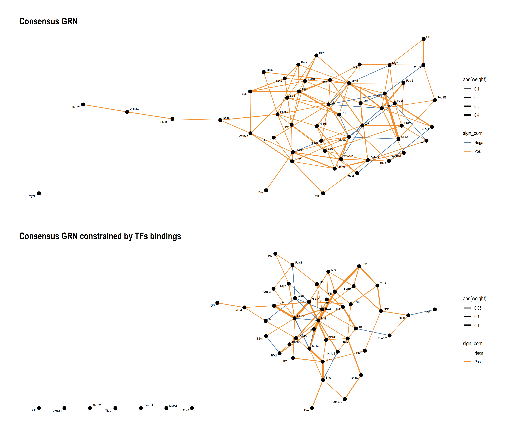

# Introduction
`scPCN` infers gene regulation network from scRNAseq data using partical correlation network and TFs binding. In the first step a consensus GRN is built as the average of PCNs based on sampled data; next TFs bindings are searched on the promoter sequences by position weight matrix (PWM) mutually, in the final step edges in consensus PCN without bindings in neither of promoter seqs are removed.

# Install
Install from github.
```r
remotes::install_github("ccshao/scTPN")
```

# Examples
Install and load necessary packages.

```r
library(ggplot2)
library(patchwork)
library(magrittr)
library(data.table)
library(tidygraph)
library(ggraph)
library(future)
library(doFuture)
library(org.Mm.eg.db)
library(TxDb.Mmusculus.UCSC.mm10.knownGene)
library(BSgenome.Mmusculus.UCSC.mm10)
library(scTPN)

#- Parallel computing
registerDoFuture()
plan(multicore, workers = 4)
```

Load the example TFs expression matrix. Data are sampled from Zeisel A, et al., 2015, followed by normalization and log2 transformation. `pcn` is used to get the consensus network.
```r
data(example_mtx)
set.seed(42)
pcn_net <- pcn(example_mtx)
```

We prepare the genome info to identify TFs bindings.
```r
gene_db  <- org.Mm.eg.db::org.Mm.egSYMBOL2EG
txdb     <- TxDb.Mmusculus.UCSC.mm10.knownGene::TxDb.Mmusculus.UCSC.mm10.knownGene
bsgenome <- BSgenome.Mmusculus.UCSC.mm10::BSgenome.Mmusculus.UCSC.mm10

#- The symmetric TFs bindings matrix, values indicate number of bound TF PWMs (one TF might have multiple PWMs.)
tf_mtx    <- pwm_pred(pcn_net, "Mmusculus", gene_db, bsgenome, txdb)
#- Binarize the matrix, converting the item with binding to 1.
tf_mtx_bi <- tf_mtx
tf_mtx_bi[tf_mtx_bi > 0] <- 1

#- Constrainted network by TF bindings.
pcn_reg <- pcn_net * tf_mtx_bi

tg_1 <- as_tbl_graph(pcn_net, directed = FALSE) %>%
  activate(edges) %>%
  mutate(sign_corr = ifelse(sign(weight) == 1, "Posi", "Nega"))

#- partial correlatio network regulized by TFs info.
tg_2 <- as_tbl_graph(pcn_reg, directed = FALSE) %>%
  activate(edges) %>%
  mutate(sign_corr = ifelse(sign(weight) == 1, "Posi", "Nega"))

mycol <- as.character(palette.colors(10, "Tableau"))

p01 <- ggraph(tg_1) +
  geom_edge_link0(aes(color = sign_corr, width = abs(weight))) +
  geom_node_point(size = 3) +
  geom_node_text(aes(label = name), repel = TRUE, size = 2) +
  theme_graph() +
  ggtitle("Filtered by pdaj") +
  scale_edge_colour_manual(values = mycol) +
  scale_edge_width(range = c(0.5, 2))

p02 <- ggraph(tg_2) +
  geom_edge_link0(aes(color = sign_corr, width = abs(weight))) +
  geom_node_point(size = 3) +
  geom_node_text(aes(label = name), repel = TRUE, size = 2) +
  theme_graph() +
  ggtitle("Filtered by pdaj and TFs bindings") +
  scale_edge_colour_manual(values = mycol) +
  scale_edge_width(range = c(0.5, 2))

q01 <- p01 / p02
```

